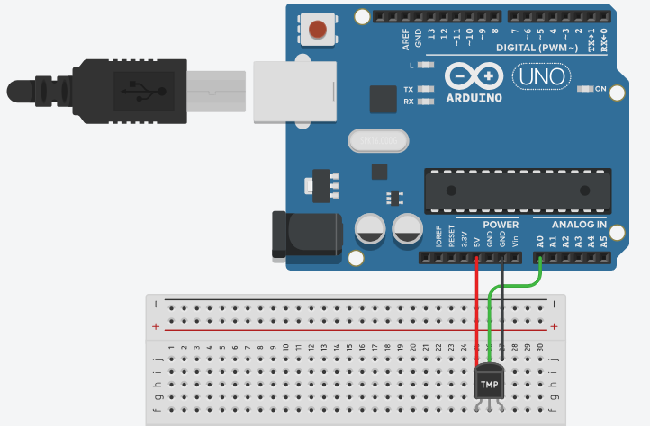

# DHT11

Este código foi desenvolvido para leitura de dados do sensor DHT11 (temperatura e umidade) com um Arduino Uno para projeto de primeiro semestre da faculdade.

## Arquitetura
O Sensor tem três entradas. Suas extremidades são para os jumpers negativo e power, conectado diretamente ao Arduino.
O jumper central é para envio de dados capturados. Deve ser conectado a uma porta ANALÓGICA.
***

***
Neste caso, está conectado à porta A0.
